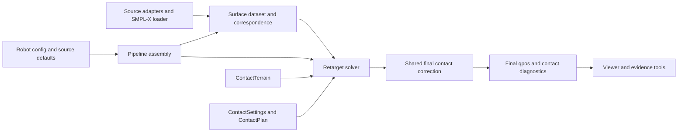

# CUMR architecture

CUMR adds contact stabilization and robot adapters to the original UMR surface
retargeter. This document describes the current implementation, not a proposed
package rewrite. Public script/config names inherited from UMR stay compatible.

## Ownership and data flow

| Owner | Current code | Responsibility |
| --- | --- | --- |
| Configuration | `scripts/humanoid_retarget_config.py`, robot JSONs, source defaults | Composition, paths, robot identity and parameter ownership. |
| Source/model adapters | `scripts/smplx_model_loader.py`, `soma_source.py`, `nr_source.py`, Character helpers | Source representation, model loading and explicit frame conversion. |
| Correspondence | `scripts/build_correspondence_ae_dataset.py`, `train_correspondence_template_residual_ae.py` | Canonical surfaces, training and ordered slots. |
| Contact math | `scripts/contact_stabilization.py` | Validated settings, detection, intervals, anchors, signatures and measurements. NumPy and standard library only. |
| Terrain | `scripts/contact_terrain.py` | Static support geometry and matching MuJoCo scene materialization. |
| Kinematic solve | `scripts/retarget_smpl_to_humanoid_surface_vector.py`, `smpl_surface_retarget_common.py` | QP objectives, joint/collision constraints, smoothing and final contact correction. |
| Streaming/source-specific solve | Batch and Character retarget scripts | Chunk/source adaptation and calls into shared contact correction. |
| Pipeline assembly | `scripts/humanoid_retarget_pipeline*.py` | Build/train/retarget/view orchestration, config propagation and cache decisions. |
| Assets | `assets/`, `assets/tienkung/rebuild_models.py` | Original robot descriptions, meshes and reproducible adapters. |
| Evidence and governance | `docs/validation/`, reproduction/check scripts, tests | Replayable claims, dependency guards and contributor guidance. |

Shared low-level modules must not depend on their orchestration callers.
Pipeline functions may assemble stages; new contact algorithms belong in the
contact owners. Robot-specific numbers belong in robot configs. Expensive mesh
parsing, bindings and terrain construction happen before per-frame optimization.
The current legacy batch/source solvers still own some inherited QP plumbing;
that is not permission to duplicate CUMR's contact implementation.

## Mandatory contracts and changes

[C01–C08](docs/architecture/CONTRACTS.md) define required invariants and their
verification. [contracts.json](docs/architecture/contracts.json) is the executable
subset used by `make check`; tests and evidence replay cover numerical behavior.
Static checks catch declared imports and missing shared call sites, not all
possible runtime behavior. Passing them never replaces semantic review.

Structural changes follow the [ADR index](docs/adr/README.md). A change affecting
a public format, source frame, configuration identity, cache semantics or shared
solver lifecycle must update its contract, migration and verification in the same
change. New checks must exercise observable behavior or a real forbidden boundary.

We adopt ownership, contracts, evidence levels and ADR organization from
[UniLab's developer guidance](docs/development/unilab_reference.md), while retaining
CUMR's own runtime and storage design.
