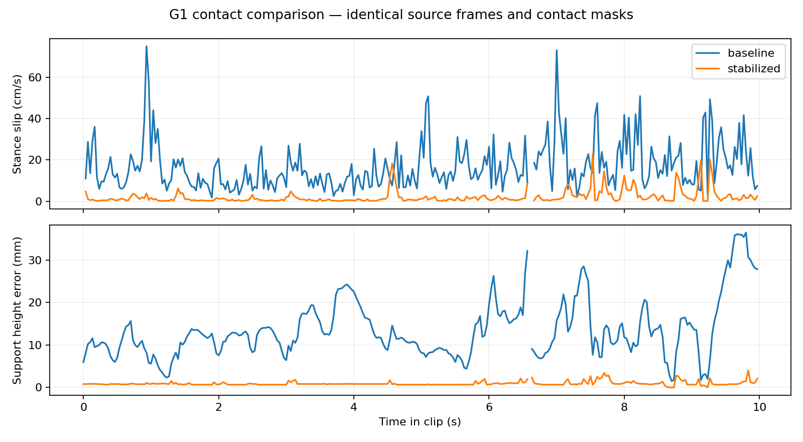

# Validation evidence and reproduction

The evidence here reports our experiments on CUMR. It is not a benchmark
published by the original UMR authors. See the
[original UMR paper and CUMR citations](../../README.md#citation).

## G1: controlled 300-frame comparison

- Source: the included `sample_data/lafan1_smplx/dance1_subject2.npz`, frames
  **300–599 inclusive**, at 30 FPS.
- Robot: the bundled Unitree G1, with the G1 example pose/limits.
- Correspondence: one shared 4096-slot model, trained for 500 epochs. Neutral
  SMPL-X with motion-derived shape; hashes are recorded in the manifest.
- Baseline: our rerun of the unmodified upstream retarget script at
  [`d6bb761`](https://github.com/hanyang9/UMR/tree/d6bb76123d19afb7c2c1c84162d1af1f142a61ed),
  with the supplied baseline configuration and the same correspondence.
  This produced `qpos` bitwise identical to the contact-disabled CUMR
  ablation on the same machine. No baseline retuning was performed.
- CUMR: contact enabled, `position_cost=100000`, eight final correction
  iterations and `projection_velocity_cost=500`. LQR smoothing is used in
  both runs. Complete effective configurations are included below.
- Evaluation: both outputs are measured with **the same** source-derived
  contact mask and robot probe bindings, containing 1936 active samples.
  Probes are selected independently of the resulting trajectory errors.

| Metric | Upstream UMR rerun | CUMR |
| --- | ---: | ---: |
| Mean stance slip (m/s) | 0.1585263 | 0.0165077 |
| Stance slip P95 (m/s) | 0.3861275 | 0.0677111 |
| Support-height error P95 (m) | 0.0345506 | 0.0020297 |
| Joint jerk P95 (rad/frame³) | 0.0549853 | 0.0627682 |

Mean slip decreases 89.5868%; joint jerk increases 14.1546%. Smaller contact
errors therefore come with a measurable smoothness cost on this clip.



Files:

- [comparison.json](g1_dance_300_599/comparison.json): machine-readable metrics.
- [manifest.json](g1_dance_300_599/manifest.json): source revision, input hashes,
  environment, protocol and SHA-256 hashes of the evidence files.
- [baseline_config.json](g1_dance_300_599/baseline_config.json) and
  [stabilized_config.json](g1_dance_300_599/stabilized_config.json): portable
  snapshots with effective contact parameters made explicit.
- [baseline.npz](g1_dance_300_599/baseline.npz) and
  [stabilized.npz](g1_dance_300_599/stabilized.npz): robot `qpos` and source/frame
  metadata. Published paths are repository-relative; string metadata needs no
  pickle. Numeric trajectories are unchanged from the measured outputs.
- [stabilized.contact.npz](g1_dance_300_599/stabilized.contact.npz): contact masks,
  probe bindings, targets, and pre/post-correction trajectories.
- [stabilized.contact.json](g1_dance_300_599/stabilized.contact.json): effective
  settings and metrics immediately before/after the final correction. Its
  pre-correction values are **not** the upstream baseline: the initial CUMR
  solve already includes contact terms.

The model/source hashes and trained-slot hash identify the original run. Model
weights and learned correspondence checkpoints are not distributed here.

## Replay published measurements

After installing the runtime dependencies, from the repository root:

```bash
git lfs pull
python scripts/reproduce_contact_validation.py
```

This verifies file checksums, recomputes MuJoCo forward kinematics from the
published robot trajectories, and checks the resulting metrics against
`comparison.json`. It requires **no SMPL-X model weights or retraining**.
Output is written to `output/reproduced_contact_validation/`, including
framewise CSV traces. A plotting rerun is optional:

```bash
python -m pip install matplotlib
python scripts/compare_contact_results.py \
  --baseline docs/validation/g1_dance_300_599/baseline.npz \
  --result docs/validation/g1_dance_300_599/stabilized.npz \
  --out output/reproduced_contact_validation/comparison.json \
  --plot output/reproduced_contact_validation/comparison.png
```

## Rebuild and rerun the experiment

First obtain the licensed neutral SMPL-X model as described in the main README.
Then:

```bash
python scripts/reproduce_contact_validation.py --run
```

This builds the correspondence dataset, trains once, and retargets the baseline
and stabilized clips on CPU using the published configurations. Both share
the same new trained slots. Runtime depends on the machine; initial training
is substantially slower than metric replay. Numerical training differences
across packages/platforms can change the result; compare against the recorded
environment rather than assuming identical new checkpoints.

To independently run upstream code as well:

```bash
git clone https://github.com/hanyang9/UMR.git ../UMR-upstream
git -C ../UMR-upstream checkout d6bb76123d19afb7c2c1c84162d1af1f142a61ed
python scripts/reproduce_contact_validation.py --run \
  --upstream-checkout ../UMR-upstream
```

An existing compatible checkpoint can be selected with `--slots PATH`; the
script still reruns both retargeting paths. The optional upstream run writes
`upstream_check.json` comparing its `qpos` with the disabled ablation. It uses
the same licensed model, data and slots as CUMR.

## What the metrics mean

- **Stance slip:** tangential displacement of each robot probe times FPS,
  evaluated only where that probe is active in both neighboring frames.
- **Support-height error:** absolute probe clearance from the supplied terrain
  at active contact samples.
- **Joint jerk:** the magnitude of the third finite difference of scalar joint
  angles, pooled across joints/frames. This is `rad/frame³`, not `rad/s³`, and
  is only compared at identical FPS. Root quaternion coordinates are excluded.
- **Penetration:** measurements refer to probes or the configured surface
  slots, as specified by each field; they do not certify the continuous mesh.

Limitations: this is one selected flat-ground dance segment, without repeated
seed trials or dataset-wide confidence intervals. Contact masks come from
source speed/height heuristics, not external ground-truth annotations. This
is kinematic optimization, with no friction-cone, dynamic-balance or hardware
tracking validation. Soft stance constraints may leave residual errors.

## TienKung integration and regression tests

[TienKung summary](tienkung/summary.json) records separate **integration smoke
runs** for 2 Dex, 2 Pro and 3: 512 points, 100 training epochs, 24 frames each,
CPU. All outputs are finite, floating-root quaternions are normalized, and
configured scalar-joint limits are satisfied. Final contact correction reduces
slip in all three runs. Their 1.3–2.1 cm P95 support-height errors exceed the
3 mm reporting tolerance; these runs do not establish final motion quality.
Standard robot configs retain 4096 points and 500 training epochs.

```bash
python -m unittest discover -s tests -v
```

All 19 tests passed locally on the recorded environment. Tests exercise false
contacts, hysteresis, heel/toe independence, FPS/stride, flight-height behavior,
terrain/MuJoCo agreement, cache invalidation, constrained IK, and the new robots'
independent URDF kinematics, limits, pelvis mass, T-pose/sole geometry and lossless
large-mesh conversion. The tests do not require licensed SMPL-X weights.
The [recorded test output](tests.txt) is included for the publication run.

Additional local smoke checks completed for a 30-frame stride-2 batch run
with seven-frame chunks and bidirectional initialization, a 12-frame Character
run, and a 12-frame heightfield run. These are functionality checks, not a
cross-dataset accuracy evaluation; the committed unit tests provide repeatable
coverage of their core contact/terrain behavior.
